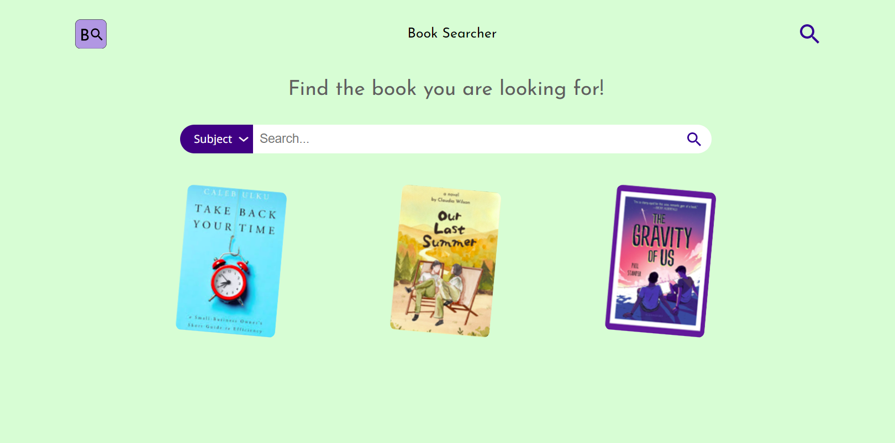

# Book Searcher

## Table of Contents
* [Description](#description)
* [Languages](#languages)
* [Dependencies](#dependencies)
* [Installation](#installation)
* [Try It!](#try-it)
* [License](#license)
* [Contact Me](#contact-me)

## Description
This is an application that helps you to find new books through [OpenLibrary API](https://openlibrary.org/developers/api).

The application consists in a search bar where you can search the contents, once the app displays the results you can quickly see their description (if available) by clicking on the result.

Currently it supports search for `title` and `subject` of the book.

## Languages
    

## Dependencies
* [Showdownjs](https://showdownjs.com/)
* [Webpack](https://webpack.js.org/)

## Installation
First of all, you need Node.js installed, you can download it [here](https://nodejs.org/it/download/).

1. Clone the repository: `git clone https://github.com/cavaliernicola/Book-Searcher.git`
1. Install the dependencies: `npm install`
1. Build it!: `npm run build`
1. Open it in the browser: `npm run open` 

## Try It!
You can try this app [HERE](https://cheery-youtiao-ac82d3.netlify.app/)!

## License
Distributed under the MIT License. See [`LICENSE`](LICENSE) for more information.

## Contact Me
* Author: Nicola Cavalier 
* Email: cavaliernicola@gmail.com
